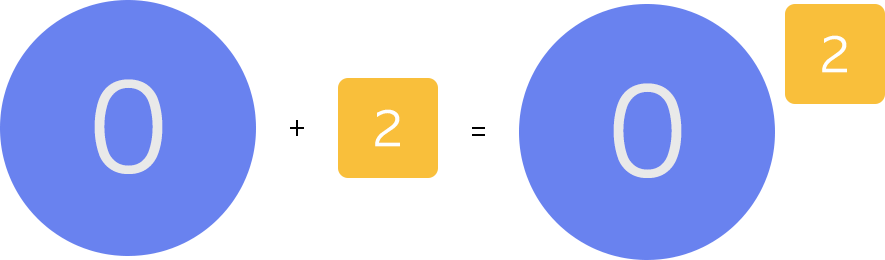

## Emilia

Css sprite tool, supports rem, supports output multiple sprites pictures.

`Emilia` gets stylesheet files and recognizes sprite mark like `url(a.png?__sprite)`, finally output updated stylesheet files as well as sprite pictures. It supports `rem` and `px`, also supports numerical conversion. Besides, it tries to be designed easier to fit different frameworks, such as fis3 or webpack.

If you are tend to build sprite pictures according to image resources, maybe you like [Lia](https://github.com/cupools/lia).

[中文文档](README.zh-CN.md)

## Getting started
```bash
npm install --save-dev emilia
```

When used in module.

```js
var Emilia = require('emilia');
var emilia = new Emilia({
    src: ['src/css/*.css'],
    dest: 'build/css/',
    output: 'build/images/',
    cssPath: '../images/',
    unit: 'rem',
    convert: 16
});

emilia.run();
```

When used in CLI.

```bash
$ emilia help

  Usage: emilia [options] [command]

  Commands:

    help                   Output usage information

  Options:

    -s, --src <src>        stylesheet path, use glob patterns
    -d, --dest <dir>       output compiled stylesheet file to <dir>
    -o, --output <dir>     output sprite pictures to <dir>
    --cssPath              image url path
    --prefix               prefix basename of sprite picture
    --algorithm            layout algorithm of sprite pictures
    --padding              padding between images
    --convert              numerical scale
    --unit                 unit of backgound-size and position
    --quiet                disabled output info in the console
```

Result like this.

```css
/*    origin stylesheet    */
.icon0 {
  background: #ccc url(../images/0.png?__icon) no-repeat;
  background-size: 128px 128px;
}
.icon2 {
  background: url(../images/2.png?__icon) no-repeat;
  background-size: 50px 50px;
}

/*    result stylesheet    */
.icon0 {
  background: #ccc url(../images/sprite-icon.png) no-repeat;
  background-position: 0rem 0rem;
  background-size: 22.875rem 16rem;
}
.icon2 {
  color: #ccc;
  background: url(../images/sprite-icon.png) no-repeat;
  background-position: -16.625rem 0rem;
  background-size: 22.875rem 16rem;
}
```



## Documentation

### `new Emilia(options)`
Constructor for a new Emilia instance

- options `Object` - Compile parameters
    - src `Array`
        - desc: Stylesheet path, use [glob patterns](https://github.com/isaacs/node-glob)
        - default: ['**/\*.css']
    - dest `String`
        - desc: output compiled stylesheet files to dir
        - default: 'build/css/'
    - output `String` 
        - desc: output sprite pictures to dir
        - default: 'build/images/'
    - cssPath `String` 
        - desc: image url path
        - default: '../images/'
    - prefix `String` 
        - desc: prefix sprite pictures' basename
        - default: 'sprite-'
    - algorithm `String` 
        - desc: layout algorithm of sprite pictures
        - default: 'binary-tree'
        - value: ['top-down' | 'left-right' | 'diagonal' | 'alt-diagonal' | 'binary-tree']
    - padding `Number` 
        - desc: padding between images
        - default: 10
    - convert `Number` 
        - desc: numerical scale
        - default: 1
    - unit `String` 
        - desc: unit of backgound-size and position
        - default: 'px'
    - quiet `Boolean` 
        - desc: disabled output info in the console
        - default: false

### `emilia.run()`
Start compilation, include `emilia.collect` and `emilia.process`.

### `emilia.collect()`
Get stylesheet files and wrap into `file` object, prepare for compilation

### `emilia.process()`
Analysises stylesheet and recognize sprite mark, creates sprite pictures with coordinates, output both sprite pictures and updated stylesheet files.

## Examples
### single stylesheet file

```js
emilia = new Emilia({
    src: ['test/fixtures/css/main.css'],
    dest: 'test/tmp/',
    output: 'test/tmp/images/',
    cssPath: './images/'
});
emilia.run();
```

```css
/* test/fixtures/css/main.css */
.icon4 {
  background: url(../images/4.png?__tom) no-repeat;
}
.icon5 {
  background: url(../images/5.png?__jerry) no-repeat;
}
.icon6 {
  background: url(../images/6.png?__jerry) no-repeat;
}
.icon7 {
  background: url(../images/7.png?__inline) no-repeat;
}
```

### mulit stylesheet file

```js
emilia = new Emilia({
    src: ['test/fixtures/css/multi_*.css'],
    dest: 'test/tmp/',
    output: 'test/tmp/'
}); 
emilia.run();
```

### rem stylesheet

```js
emilia = new Emilia({
    src: ['test/fixtures/css/rem.css'],
    dest: 'test/tmp/',
    output: 'test/tmp/',
    cssPath: './',
    prefix: '',
    algorithm: 'top-down',
    padding: 100,
    unit: 'rem',
    convert: 16,
    quiet: true
});
emilia.run();
```

### inline image

```css
.icon {
    background: url(../images/icon?__inline);
}
```

### use in CLI

```bash
$ emilia -s fixtures/css/main.css,fixtures/css/multi_*.css
[warn]: ../images/undefined.png not exists
[warn]: ../images/undefined.png not exists
[info]: Created build/images/sprite-tom.png
[info]: Created build/images/sprite-jerry.png
[info]: Created build/css/main.css
[info]: Created build/css/multi_one.css
[info]: Created build/css/multi_two.css
```

## Test
```bash
$ npm run test
```

## License

Copyright (c) 2016 cupools

Licensed under the MIT license.